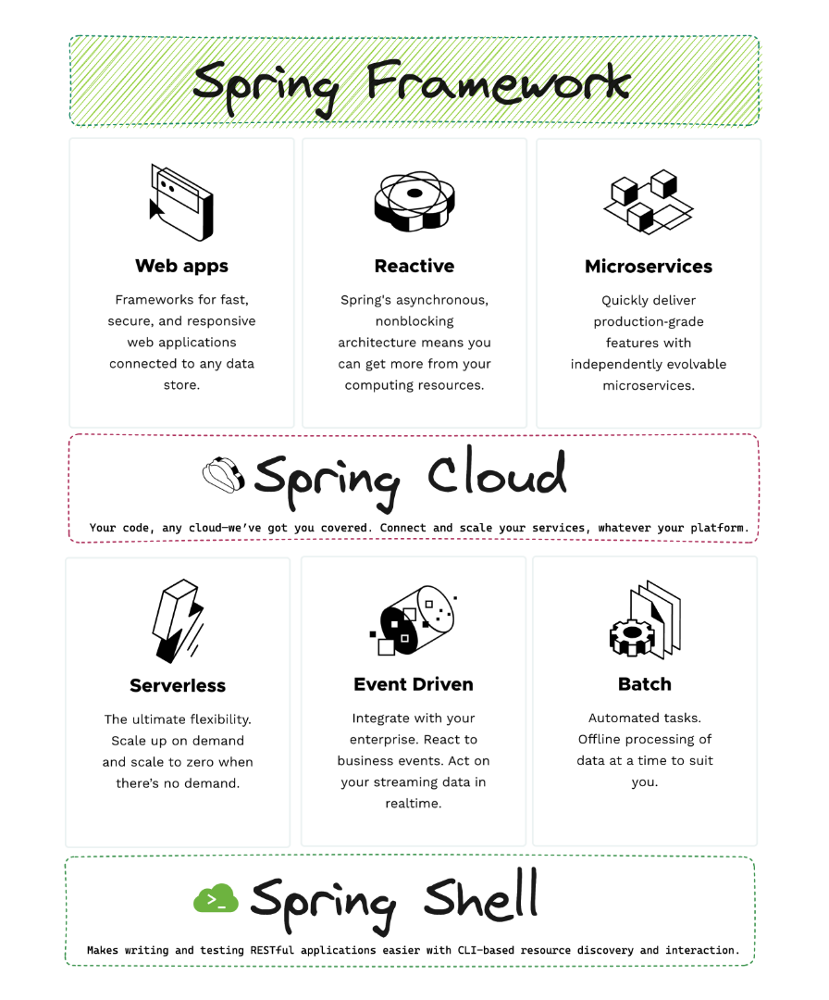
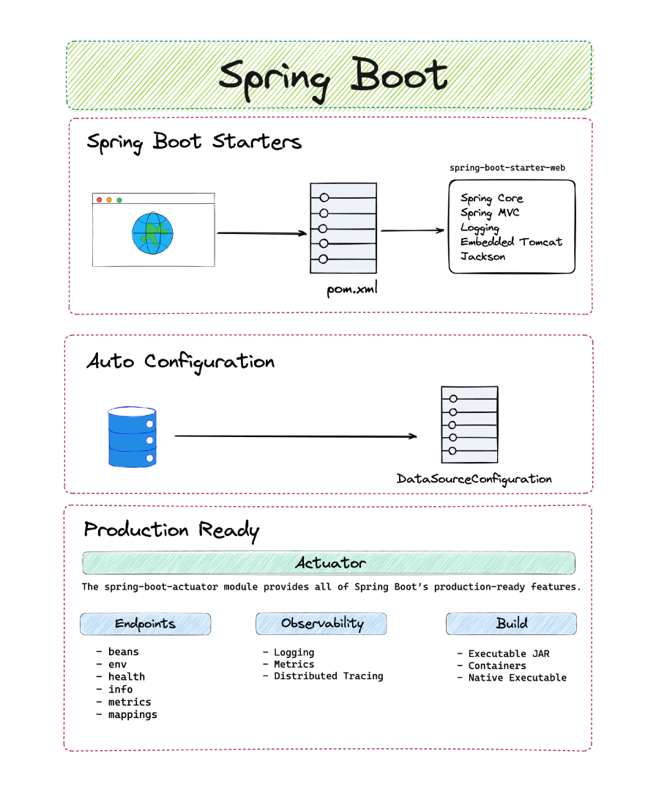
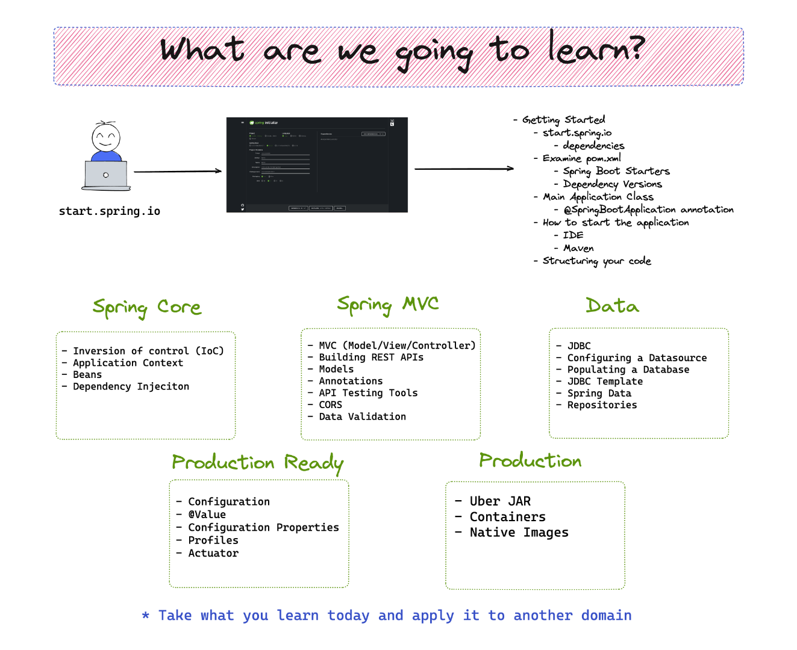
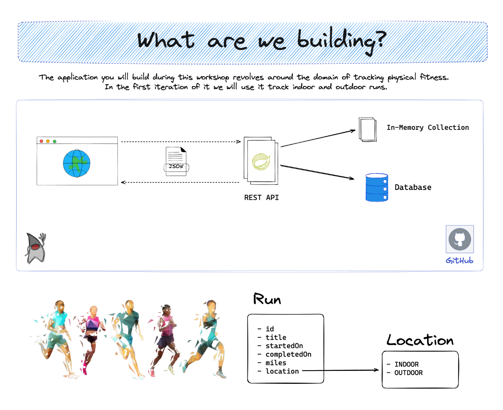

# Introduction

In this section we will tell you a little bit about us, the agenda for this workshop and a gentle introduction to Spring.

## Who are we?

- Dan Vega
- DaShaun Carter

### About Dan Vega

- Husband & Father
- Cleveland, OH
- Software Developer 22+ Years
- Spring Developer Advocate
- Content Creator www.danvega.dev
  - Writing - Blog & Newsletter
  - YouTuber
- @therealdanvega

### About DaShaun Carter

- Husband & Father
- Kansas City, MO
- Youth Coach
- Struggling triathlete
- Raspberry Pi enthusiast
- Former professional cheerleader
- Spring Developer Advocate
- Deliberately practicing to build, run, and manage, better software, faster.
- @dashaun

### Spring Office Hours

Join Dan Vega and DaShaun Carter as they explore what’s new in the world of Spring. This is your chance to stay connected to what’s happening with the Spring Framework, related projects, and the community. During this live show, Dan and DaShaun will review the current news, demo a Spring related project they find interesting and answer any questions you might have.

[https://tanzu.vmware.com/developer/tv/spring-office-hours/](https://tanzu.vmware.com/developer/tv/spring-office-hours/)

### Workshop Agenda

Walk through the course overview, prerequisites, and agenda found in the [README.md](./README.md)

At this point we want to make sure everyone's laptop is ready to go before we start writing some code.

- java -version
- macOS/Windows/Linux
  - DaShaun show Windows / Linux setup

### What is Spring?

- What types of applications can you build with Spring? (Motivation for the workshop)
- Spring Framework vs Spring Boot
- Spring.io walkthrough
  - Reference Documentation
  - API Documentation
  - Spring Project Ecosystem
- Tanzu Developer Center
- Spring.Academy

### Spring Boot Features

### What are we going to learn?

### Spring Documentation 

- https://spring.io/
- https://spring.io/blog
- https://spring.io/guides 
- https://spring.io/projects
- https://spring.io/projects/spring-framework
- https://spring.io/projects/spring-boot 

### What are we going to build?

