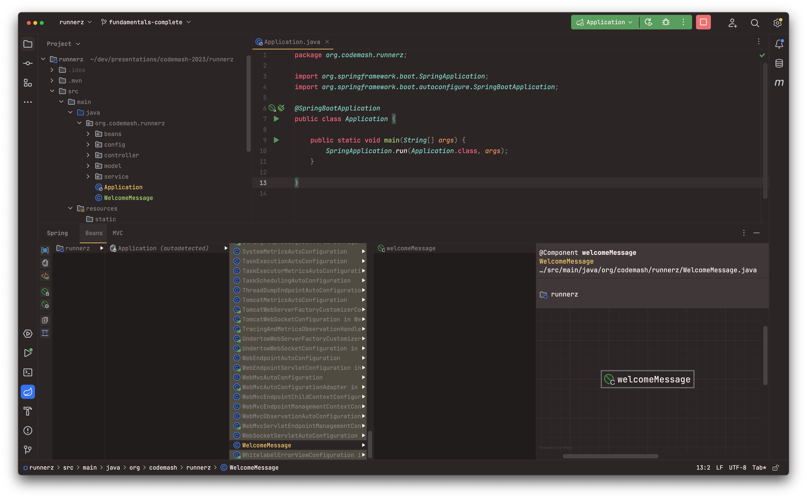

# Getting Started

  - start.spring.io
  - Understanding the project structure
    - `pom.xml`
      - Spring Boot Starters
      - Dependencies
          - Versions
          - Adding your own dependencies
    - Main Application Class
      - @SpringBootApplication annotation
  - How to start the application
    - IDE
    - Maven
    - View the application / browser & command-line
  - Structuring your code
    - package by layer
    - package by feature
    - hexigonal architecture

## Structuring you code

There is no requirement for structuring your code in a specific way. However, there are some best practices that you should follow.

    - Try to avoid creating a class that does not include a package declearation (default package).
    - Main Application in root package above other classes.
    - If you're on a team create a plan that makes sense for your team (and not just you).
    - Architecture (Layered/Hexigonal/).

Creat the following class in /src/main/java - default package:

```java
import org.springframework.stereotype.Component;

@Component
public class WelcomeMessage {

    public String getDefaultMessage() {
        return "Hello, Runnerz!";
    }

}
```

Start the application, this class 'bean' is nowhere to be found. If you move it into a package that is above where your
main application class is you will have the same problem.



`/src/main/java/org/codemash/runnerz/WelcomeMessage.java`

