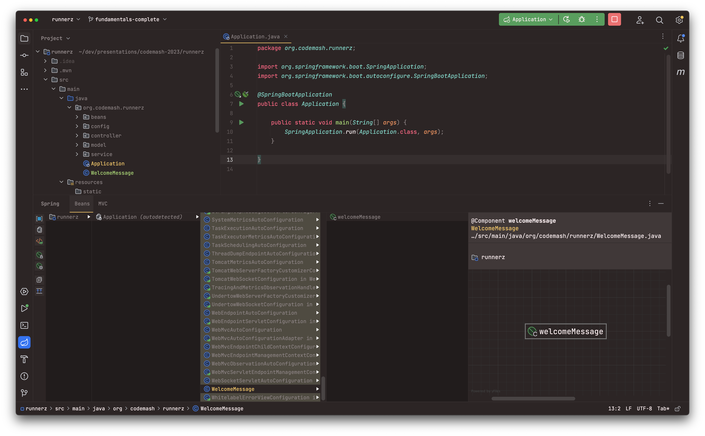
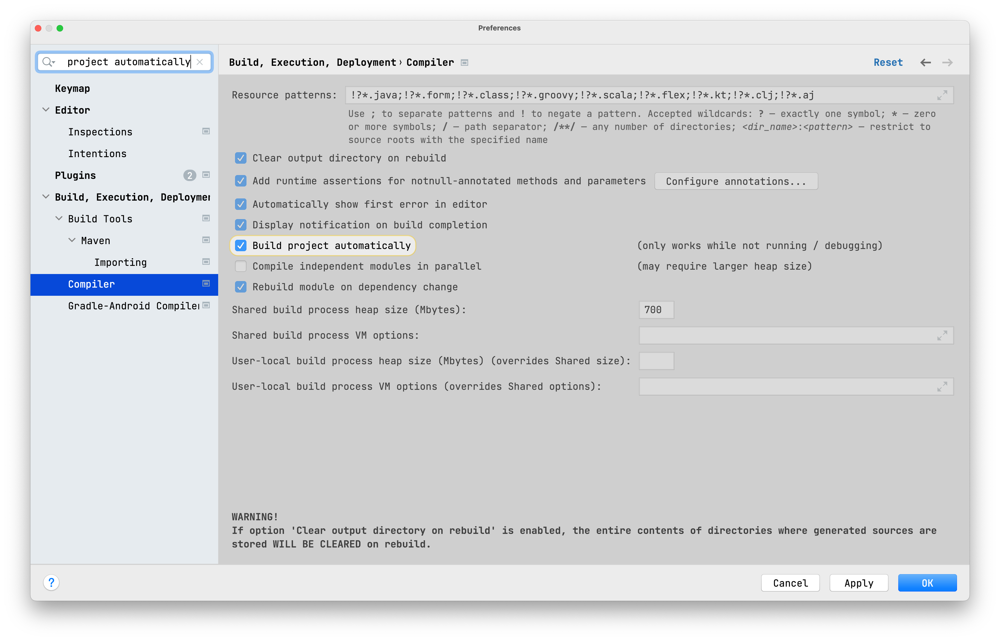
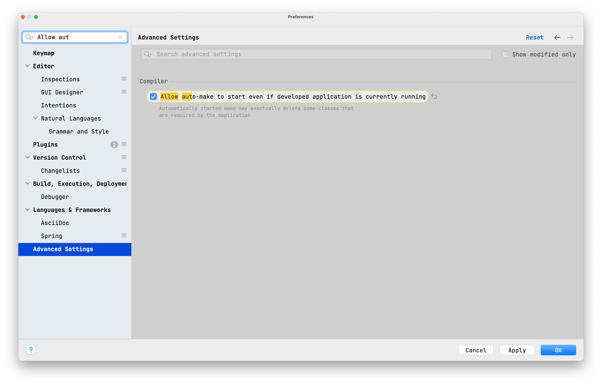

# Core Fundamentals & Features

In this section you are going to learn about a few of the core fundamentals of Spring. It doesn't make sense to take a
deep dive into these topics now because it might be a little confusing and overwhelming. Understanding what some of these
terms mean is enough to get you going. Once you have a foundation for building Spring applications you can go back to
the documentation and revisit them for a bit of a deeper dive.

## Structuring you code

There is no requirement for structuring your code in a specific way. However, there are some best practices that you should follow.

    - Try to avoid creating a class that does not include a package declearation (default package).
    - Main Application in root package above other classes.
    - If you're on a team create a plan that makes sense for your team (and not just you).
    - Architecture (Layered/Hexigonal/).

Creat the following class in /src/main/java - default package: 

```java
import org.springframework.stereotype.Component;

@Component
public class WelcomeMessage {

    public String getDefaultMessage() {
        return "Hello, Runnerz!";
    }

}
```

Start the application, this class 'bean' is nowhere to be found. If you move it into a package that is above where your 
main application class is you will have the same problem. 



`/src/main/java/org/codemash/runnerz/WelcomeMessage.java`

## Spring IoC Container / Application Context

The `org.springframework.context.ApplicationContext` interface represents the Spring IoC container and is responsible for instantiating, configuring, and assembling the beans.

- Open `org.springframework.context.ApplicationContext`
- View the classes it inherits from (superclasses)`
- The configuration metadata is represented in XML, Java annotations, or Java code.

```java
@SpringBootApplication
public class Application {
	
	public static void main(String[] args) {
		ConfigurableApplicationContext context = SpringApplication.run(Application.class, args);
		Arrays.stream(context.getBeanDefinitionNames()).forEach(System.out::println);
	}
	
}
```

You can view the beans in the `ApplicationContext` from IntelliJ's Spring Windows

## Spring Beans

A Spring IoC container manages one or more beans. These beans are created with the configuration metadata that you supply to the container.

- Please raise your had if you ever created an instance of class 🙋🏼‍♂️
- We need to tell Spring about the classes we want it to manage for us
- Your Class + Configuration Metadata = Spring Bean
  - [Class](https://docs.spring.io/spring-framework/docs/current/reference/html/core.html#beans-factory-class)
  - [Name](https://docs.spring.io/spring-framework/docs/current/reference/html/core.html#beans-beanname)
  - [Scopes](https://docs.spring.io/spring-framework/docs/current/reference/html/core.html#beans-factory-scopes)
  - more ...
- @Component
  - @Controller
  - @RestController
  - @Service
  - @Repository
- @Bean
  - Create a `@Configuration` class

Now that you understand what a bean is and the container that manages them we can revisit the problem we took a look at
earlier. 

- `@ComponentScan(basePackages = {"dev.danvega"})`
- `@SpringBootApplication(scanBasePackages = {"dev.danvega"})`
- `Arrays.stream(context.getBeanDefinitionNames()).forEach(System.out::println);`
- You can view the definitions of the Spring beans used in your project, and see how they are related to other beans, in the Spring tool window.

## Dependency Injection & IoC

Now that you understand what Beans and the container are we can talk about Dependency Injection (DI) and Inversion of
Control (IoC). Dependency injection (DI) is a process whereby objects define their dependencies (that is, the other objects with which they work) only through constructor arguments, arguments to a factory method, or properties that are set on the object instance after it is constructed or returned from a factory method. The container then injects those dependencies when it creates the bean.

- `RunController` depends on -> `RunService`
- Unit Test the controller
- `@Autowired`

```java
public record Run(Integer id, String title) {
    
}
```

```java
@Service
public class RunService {

    private final List<Run> runs = new ArrayList<>();

    public RunService() {
        runs.add(new Run(1,"Monday Morning Run"));
    }

    public List<Run> findAll() {
        return runs;
    }

}
```

```java
@RestController
public class RunController {

    private final RunService runService;

    public RunController() {
        runService = new RunService();
    }

    public List<Run> findAll() {
        return runService.findAll();
    }

}
```

```java
class RunControllerTest {

    RunController controller;

    @BeforeEach
    void setUp() {
        controller = new RunController();
    }

    @Test
    void shouldFindAllRuns() {
        Assertions.assertEquals(1,controller.findAll().size());
    }

}
```

There are 3 types of DI but only 2 of them are recommended: 

1. Constructor-based Dependency Injection
2. Setter-based Dependency Injection
3. Field-based Dependency Injection

Now that we have correctly setup Dependency Injection we could mock out the `RunService`: 

```java
@SpringBootTest
class RunControllerTest {

    RunController controller;

    @MockBean
    RunService runService;

    private List<Run> runs = new ArrayList<>();

    @BeforeEach
    void setUp() {
        controller = new RunController(runService);
        runs.add(new Run(1,"Monday Morning Run"));
    }

    @Test
    void shouldFindAllRuns() {
        Mockito.when(runService.findAll()).thenReturn(runs);
        Assertions.assertEquals(1,controller.findAll().size());
    }

}
```

[Spring Constructor Injection: Why is it the recommended approach to Dependency Injection?](https://youtu.be/aX-bgylmprA)

## Configuration

Spring Boot lets you externalize your configuration so that you can work with the same application code in different environments. You can use a variety of external configuration sources, include Java properties files, YAML files, environment variables, and command-line arguments.

- application.properties / application.yml
  - If you have configuration files with both .properties and .yml format in the same location, .properties takes precedence.
  - server.port=8085
- Externalized Configuration (Property Sources)
  - https://docs.spring.io/spring-boot/docs/current/reference/html/features.html#features.external-config
  - Run Configuration SERVER.PORT=8081
- Injecting values into your code
- Configuration Properties

```properties
greeting.message=Hello, Runnerz!
```

```java
@RestController
public class GreetingController {

    @Value("${greeting.message}")
    private String welcomeMessage;

    @GetMapping("/")
    public String home() {
        return welcomeMessage;
    }

}
```

```java
@ConfigurationProperties("runnerz")
public record RunnerzConfigProperties(String welcomeMessage, Integer maxRows) {
}
```

```java
@Bean
CommandLineRunner commandLineRunner(RunnerzConfigProperties props) {
    return (args) -> {
        System.out.println(props.welcomeMessage());
        System.out.println(props.maxRows());
    };
}
```

## Profiles

Spring Profiles provide a way to segregate parts of your application configuration and make it be available only in certain environments. Any `@Component`, `@Configuration` or `@ConfigurationProperties` can be marked with `@Profile` to limit when it is loaded, as shown in the following example:

```java
@Configuration
@Profile("production")
public class ProductionConfiguration {}
```

- What are profiles
- Why would you want to use them?
  - application-dev.properties
  - application-prod.properties
- Run the application show default profile
- `spring.profiles.active=dev,local`

### Multi-Document Files

Spring Boot allows you to split a single physical file into multiple logical documents which are each added independently. Documents are processed in order, from top to bottom. Later documents can override the properties defined in earlier ones.

For application.yml files, the standard YAML multi-document syntax is used. Three consecutive hyphens represent the end of one document, and the start of the next.

For example, the following file has two logical documents:

```yaml
spring:
  application:
    name: "MyApp"
---
spring:
  application:
    name: "MyCloudApp"
  config:
    activate:
      on-cloud-platform: "kubernetes"
```

For application.properties files a special #--- or !--- comment is used to mark the document splits:

```properties
# spring.application.name=MyApp
#---
spring.application.name=MyCloudApp
spring.config.activate.on-cloud-platform=kubernetes
```

## Production-ready Features / Actuator

Spring Boot includes a number of additional features to help you monitor and manage your application when you push it to production. You can choose to manage and monitor your application by using HTTP endpoints or with JMX. Auditing, health, and metrics gathering can also be automatically applied to your application.

- Actuator 
- Observability (Spring Boot 3)
  - Logging
  - Metrics 
  - Distributed Tracing

To add the actuator to a Maven-based project, add the following ‘Starter’ dependency:

```xml
<dependencies>
    <dependency>
        <groupId>org.springframework.boot</groupId>
        <artifactId>spring-boot-starter-actuator</artifactId>
    </dependency>
</dependencies>
```

### Endpoints 

Actuator endpoints let you monitor and interact with your application. Spring Boot includes a number of built-in endpoints and lets you add your own. You can enable or disable each individual endpoint and expose them (make them remotely accessible) over HTTP or JMX.

https://docs.spring.io/spring-boot/docs/current/reference/html/actuator.html#actuator.endpoints

- Show actuator tab in IntelliJ (only health is available by default)
- Enable all endpoints 

```properties
# enable specific endpoints
# management.endpoints.web.exposure.include=beans,env

# enable all endpoints 
management.endpoints.web.exposure.include=*

# show health detail
management.endpoint.health.show-details=always
```

Health information is collected from Health Contributors. Spring Boot includes a number of auto-configured 
HealthContributors, and you can also write your own. 


### Application Information 

Application information exposes various information collected from all InfoContributor beans defined in your ApplicationContext. Spring Boot includes a number of auto-configured InfoContributor beans, and you can write your own.

```properties
management.info.java.enabled=true
management.info.os.enabled=true
```

## Logging

What/Why/Logging?

Default configurations are provided for Java Util Logging, Log4j2, and Logback. In each case, loggers are pre-configured to use console output with optional file output also available.

- Examine how this included by default 
  - `spring-boot-starter-web` -> `spring-boot-starter` -> `spring-boot-starter-logging`
  - Logback is the default
  - You can change this, check out the documentation

```xml
  <dependencies>
    <dependency>
      <groupId>ch.qos.logback</groupId>
      <artifactId>logback-classic</artifactId>
      <version>1.4.5</version>
      <scope>compile</scope>
    </dependency>
    <dependency>
      <groupId>org.apache.logging.log4j</groupId>
      <artifactId>log4j-to-slf4j</artifactId>
      <version>2.19.0</version>
      <scope>compile</scope>
    </dependency>
    <dependency>
      <groupId>org.slf4j</groupId>
      <artifactId>jul-to-slf4j</artifactId>
      <version>2.0.4</version>
      <scope>compile</scope>
    </dependency>
  </dependencies>
```

Run the application and view the console. The following items are output:

- **Date and Time:** Millisecond precision and easily sortable.
- **Log Level:** ERROR, WARN, INFO, DEBUG, or TRACE.
- **Process ID**
- **A --- separator** to distinguish the start of actual log messages.
- **Thread name:** Enclosed in square brackets (may be truncated for console output).
- **Logger name:** This is usually the source class name (often abbreviated).
- **The log message**

### Debug

The default log configuration echoes messages to the console as they are written. By default, ERROR-level, WARN-level, and INFO-level messages are logged. You can also enable a “debug” mode by starting your application with a --debug flag.

- program arguments --debug
- debug=true

When the debug mode is enabled, a selection of core loggers (embedded container, Hibernate, and Spring Boot) are configured to output more information. Enabling the debug mode does not configure your application to log all messages with DEBUG level.

### Log Levels

All the supported logging systems can have the logger levels set in the Spring Environment (for example, in application.properties) by using `logging.level.<logger-name>=<level>` where level is one of TRACE, DEBUG, INFO, WARN, ERROR, FATAL, or OFF. The root logger can be configured by using logging.level.root.

```properties
logging.level.root=warn
logging.level.org.springframework.web=debug
logging.level.org.hibernate=error
```

### Adding your own Logging Statements

- SLF4j
- IntelliJ Templates
- Different Logging Levels for different profiles
- Update logging levels via properties & at runtime

```java
@SpringBootApplication
public class Application {

	private static final Logger log = LoggerFactory.getLogger(Application.class);

	public static void main(String[] args) {
		SpringApplication.run(Application.class, args);
		log.trace("TRACE log message.");
		log.debug("DEBUG log message.");
		log.info("INFO log message.");
		log.warn("WARN log message.");
		log.error("ERROR log message.");
	}
}
```

You can use the actuators loggers endpoint to update logging configuration at runtime:

http://localhost:8080/actuator/loggers
http://localhost:8080/actuator/loggers/org.codemash.runnerz.Application

```bash
http :8080/actuator/loggers/org.codemash.runnerz.Application configuredLevel=TRACE
```

### Logging to a file

```properties
logging.file.name=runnerz.log
```

### Logback Configuration 

Create a new file `logback-spring.xml` and make sure to include `base.xml` or you will have no logging at all.

```xml
<?xml version="1.0" encoding="UTF-8"?>
<configuration>
    <include resource="org/springframework/boot/logging/logback/base.xml"/>
    <logger name="org.codemash.controllers" level="WARN" additivity="false">
        <appender-ref ref="CONSOLE"/>
        <appender-ref ref="FILE"/>
    </logger>
</configuration>
```

## DevTools

Spring Boot includes an additional set of tools that can make the application development experience a little more pleasant. The spring-boot-devtools module can be included in any project to provide additional development-time features.

```xml
<dependencies>
    <dependency>
        <groupId>org.springframework.boot</groupId>
        <artifactId>spring-boot-devtools</artifactId>
        <optional>true</optional>
    </dependency>
</dependencies>
```

- Property Defaults
- Automatic Restarts

### Property Defaults 

Several of the libraries supported by Spring Boot use caches to improve performance. For example, template engines cache compiled templates to avoid repeatedly parsing template files. Also, Spring MVC can add HTTP caching headers to responses when serving static resources.

While caching is very beneficial in production, it can be counter-productive during development, preventing you from seeing the changes you just made in your application. For this reason, spring-boot-devtools disables the caching options by default.

- server.error.include-binding-errors: always
- server.error.include-message: always 
- server.error.include-stacktrace: always 
- server.servlet.jsp.init-parameters.development: true
- server.servlet.session.persistent: true  
- spring.freemarker.cache:false
- spring.graphql.graphiql.enabled: true  
- spring.groovy.template.cache:false
- spring.h2.console.enabled: true  
- spring.mustache.servlet.cache:false
- spring.mvc.log-resolved-exception: true  
- spring.reactor.debug: true  
- spring.template.provider.cache:false
- spring.thymeleaf.cache:false
- spring.web.resources.cache.period: 0
- spring.web.resources.chain.cache:false

https://docs.spring.io/spring-boot/docs/current/reference/html/using.html#using.devtools.property-defaults


### Automatic Restarts

Applications that use spring-boot-devtools automatically restart whenever files on the classpath change. This can be a useful feature when working in an IDE, as it gives a very fast feedback loop for code changes. By default, any entry on the classpath that points to a directory is monitored for changes. Note that certain resources, such as static assets and view templates, do not need to restart the application.





By default, each time your application restarts, a report showing the condition evaluation delta is logged.

```properties
spring.devtools.restart.log-condition-evaluation-delta=false
```

#### Restart vs Reload

The restart technology provided by Spring Boot works by using two classloaders. Classes that do not change (for example, those from third-party jars) are loaded into a base classloader. Classes that you are actively developing are loaded into a restart classloader. When the application is restarted, the restart classloader is thrown away and a new one is created. This approach means that application restarts are typically much faster than “cold starts”, since the base classloader is already available and populated.


## Lecture Notes

- Browser Tabs
  - Fundamentals Lecture Notes
- IntelliJ
  - `fundamentals-start` branch