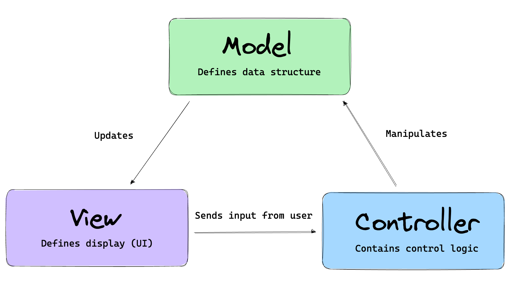

# Spring MVC (Web)

  - Model View Controller (MVC)
    - What is MVC (Model/View/Controller)
  - Spring MVC
    - Model
    - Controller
  - Spring Core
    - Spring IoC Container / Application Context
    - Spring Beans
    - Dependency Injection
  - Building REST APIs
    - What is REST API
    - Annotations
    - CRUD REST API
    - API testing (curl/httpie/postman)
    - CORS
  - Dependency Injection
  - Error Handling
  - Data Validation
  - RunnerzUI (UI/REST API/CORS/etc...)

## Model View Controller (MVC)

MVC (Model-View-Controller) is a pattern in software design commonly used to implement user interfaces, data, and controlling logic. It emphasizes a separation between the software's business logic and display. This "separation of concerns" provides for a better division of labor and improved maintenance.



### Model

The model defines what data the app should contain. If the state of this data changes, then the model will usually notify the view (so the display can change as needed) and sometimes the controller (if different logic is needed to control the updated view).

### View

The view defines how the app's data should be displayed.

### Controller

The controller contains logic that updates the model and/or view in response to input from the users of the app.


### MVC Arond the web

what other MVC frameworks are out there?

## Spring MVC

In this section you will begin to build out the foundation for our Runnerz Application.

### Model

- Run
  - Create `Run.java` as a class
  - Convert to a record
- Location (Enum)

```java
public record Run(
        Integer id,
        String title,
        LocalDateTime startedOn,
        LocalDateTime completedOn,
        Integer miles,
        Location location
) {
}
```

```java
public enum Location {
    INDOOR,
    OUTDOOR
}
```

### View (JSON)

JavaScript Object Notation (JSON) is a standard text-based format for representing structured data based on JavaScript object syntax. It is commonly used for transmitting data in web applications (e.g., sending some data from the server to the client, so it can be displayed on a web page, or vice versa).

```json
{
"id": 1,
"title": "Monday Morning Run",
"startedOn": "2023-06-15T09:29:43.013931",
"completedOn": "2023-06-15T09:59:43.013945",
"miles": 3,
"location": "INDOOR",
"duration": "PT30M0.000014S",
"avgPace": 10
}
```

```json
[
  {
    "id": 1,
    "title": "Monday Morning Run",
    "startedOn": "2023-06-15T09:29:43.013931",
    "completedOn": "2023-06-15T09:59:43.013945",
    "miles": 3,
    "location": "INDOOR",
    "duration": "PT30M0.000014S",
    "avgPace": 10
  },
  {
    "id": 2,
    "title": "Wednesday Evening Run",
    "startedOn": "2023-06-15T09:29:43.014008",
    "completedOn": "2023-06-15T10:29:43.014011",
    "miles": 6,
    "location": "INDOOR",
    "duration": "PT1H0.000003S",
    "avgPace": 10
  }
]
```

### Controller

- RunController
  - Create `RunController.java` as a class
  - Convert to a `@RestController`
  - Add `@RequestMapping("/api/runs")`
  - Add `@GetMapping`
  - Add `@GetMapping("/{id}")`
  - Add `@PostConstruct` to initialize some data

```java
@RestController
@RequestMapping("/api/runs")
public class RunController {

    private final List<Run> runs = new ArrayList<>();

    @GetMapping
    public List<Run> findAll() {
        return runs;
    }

    @GetMapping("/{id}")
    public Optional<Run> findById(@PathVariable Integer id) {
        return runs.stream().filter(run -> run.id().equals(id)).findFirst();
    }

    @PostConstruct
    private void init() {
        runs.add(new Run(1,
                "Monday Morning Run",
                LocalDateTime.now(),
                LocalDateTime.now().plus(30, ChronoUnit.MINUTES),
                3,
                Location.INDOOR));

        runs.add(new Run(2,
                "Wednesday Evening Run",
                LocalDateTime.now(),
                LocalDateTime.now().plus(60, ChronoUnit.MINUTES),
                6,
                Location.INDOOR));
    }

}
```


## Spring IoC Container / Application Context

  - Spring IoC Container / Application Context
  - Spring Beans
  - Dependency Injection


### Spring IoC Container / Application Context

The `org.springframework.context.ApplicationContext` interface represents the Spring IoC container and is responsible for instantiating, configuring, and assembling the beans.

- Open `org.springframework.context.ApplicationContext`
- View the classes it inherits from (superclasses)`
- The configuration metadata is represented in XML, Java annotations, or Java code.

```java
@SpringBootApplication
public class Application {

	public static void main(String[] args) {
		ConfigurableApplicationContext context = SpringApplication.run(Application.class, args);
		Arrays.stream(context.getBeanDefinitionNames()).forEach(System.out::println);
	}

}
```

You can view the beans in the `ApplicationContext` from IntelliJ's Spring Windows

### Spring Beans

A Spring IoC container manages one or more beans. These beans are created with the configuration metadata that you supply to the container.

- Please raise your had if you ever created an instance of class 🙋🏼‍♂️
- We need to tell Spring about the classes we want it to manage for us
- Your Class + Configuration Metadata = Spring Bean
  - [Class](https://docs.spring.io/spring-framework/docs/current/reference/html/core.html#beans-factory-class)
  - [Name](https://docs.spring.io/spring-framework/docs/current/reference/html/core.html#beans-beanname)
  - [Scopes](https://docs.spring.io/spring-framework/docs/current/reference/html/core.html#beans-factory-scopes)
  - more ...
- @Component
  - @Controller
  - @RestController
  - @Service
  - @Repository
- @Bean
  - Create a `@Configuration` class

Now that you understand what a bean is and the container that manages them we can revisit the problem we took a look at
earlier.

- `@ComponentScan(basePackages = {"dev.danvega"})`
- `@SpringBootApplication(scanBasePackages = {"dev.danvega"})`
- `Arrays.stream(context.getBeanDefinitionNames()).forEach(System.out::println);`
- You can view the definitions of the Spring beans used in your project, and see how they are related to other beans, in the Spring tool window.

### Dependency Injection & IoC

Now that you understand what Beans and the container are we can talk about Dependency Injection (DI) and Inversion of
Control (IoC). Dependency injection (DI) is a process whereby objects define their dependencies (that is, the other objects with which they work) only through constructor arguments, arguments to a factory method, or properties that are set on the object instance after it is constructed or returned from a factory method. The container then injects those dependencies when it creates the bean.

- `RunController` depends on -> `RunService`
- Unit Test the controller
- `@Autowired`

```java
public record Run(Integer id, String title) {

}
```

```java
@Service
public class RunService {

    private final List<Run> runs = new ArrayList<>();

    public RunService() {
        runs.add(new Run(1,"Monday Morning Run"));
    }

    public List<Run> findAll() {
        return runs;
    }

}
```

```java
@RestController
public class RunController {

    private final RunService runService;

    public RunController() {
        runService = new RunService();
    }

    public List<Run> findAll() {
        return runService.findAll();
    }

}
```

```java
class RunControllerTest {

    RunController controller;

    @BeforeEach
    void setUp() {
        controller = new RunController();
    }

    @Test
    void shouldFindAllRuns() {
        Assertions.assertEquals(1,controller.findAll().size());
    }

}
```

There are 3 types of DI but only 2 of them are recommended:

1. Constructor-based Dependency Injection
2. Setter-based Dependency Injection
3. Field-based Dependency Injection

Now that we have correctly setup Dependency Injection we could mock out the `RunService`:

```java
@SpringBootTest
class RunControllerTest {

    RunController controller;

    @MockBean
    RunService runService;

    private List<Run> runs = new ArrayList<>();

    @BeforeEach
    void setUp() {
        controller = new RunController(runService);
        runs.add(new Run(1,"Monday Morning Run"));
    }

    @Test
    void shouldFindAllRuns() {
        Mockito.when(runService.findAll()).thenReturn(runs);
        Assertions.assertEquals(1,controller.findAll().size());
    }

}
```

[Spring Constructor Injection: Why is it the recommended approach to Dependency Injection?](https://youtu.be/aX-bgylmprA)


## Building REST APIs

  - Building REST APIs
    - What is REST API
    - Request Methods
    - Http Status Codes
    - Annotations
        - @RestController
        - @RequestMapping
        - @ResponseStatus
        - etc
    - CRUD REST API
        - GET / POST / PUT / DELETE
    - API testing (curl/httpie/postman)
    - CORS

### APIs

API stands for Application Programming Interface. An API is a software intermediary that allows two applications to talk to each other. In other words, an API is the messenger that delivers your request to the provider that you're requesting it from and then delivers the response back to you.

### REST APIs

REST (Representational State Transfer) refers to a group of software architecture design constraints that bring about efficient, reliable and scalable distributed systems.

The basic idea of REST is that a resource, e.g. a document, is transferred via well-recognized, language-agnostic, and reliably standardized client/server interactions. Services are deemed RESTful when they adhere to these constraints.

HTTP APIs in general are sometimes colloquially referred to as RESTful APIs, RESTful services, or REST services, although they don't necessarily adhere to all REST constraints. Beginners can assume a REST API means an HTTP service that can be called using standard web libraries and tools.

### HTTP Request Methods

HTTP defines a set of request methods to indicate the desired action to be performed for a given resource. Although they can also be nouns, these request methods are sometimes referred to as HTTP verbs. Each of them implements a different semantic, but some common features are shared by a group of them: e.g. a request method can be safe, idempotent, or cacheable.

GET
The GET method requests a representation of the specified resource. Requests using GET should only retrieve data.

HEAD
The HEAD method asks for a response identical to a GET request, but without the response body.

POST
The POST method submits an entity to the specified resource, often causing a change in state or side effects on the server.

PUT
The PUT method replaces all current representations of the target resource with the request payload.

DELETE
The DELETE method deletes the specified resource.

CONNECT
The CONNECT method establishes a tunnel to the server identified by the target resource.

OPTIONS
The OPTIONS method describes the communication options for the target resource.

TRACE
The TRACE method performs a message loop-back test along the path to the target resource.

PATCH
The PATCH method applies partial modifications to a resource.

### HTTP Response Status Codes

HTTP response status codes indicate whether a specific HTTP request has been successfully completed. Responses are grouped in five classes:

- Informational responses (100 – 199)
- Successful responses (200 – 299)
- Redirection messages (300 – 399)
- Client error responses (400 – 499)
- Server error responses (500 – 599)

### Annotations

### CRUD REST API


## Data Validation

## Error Handling

## RunnerzUI

[RunnerzUI](./RunnerzUI.md)
