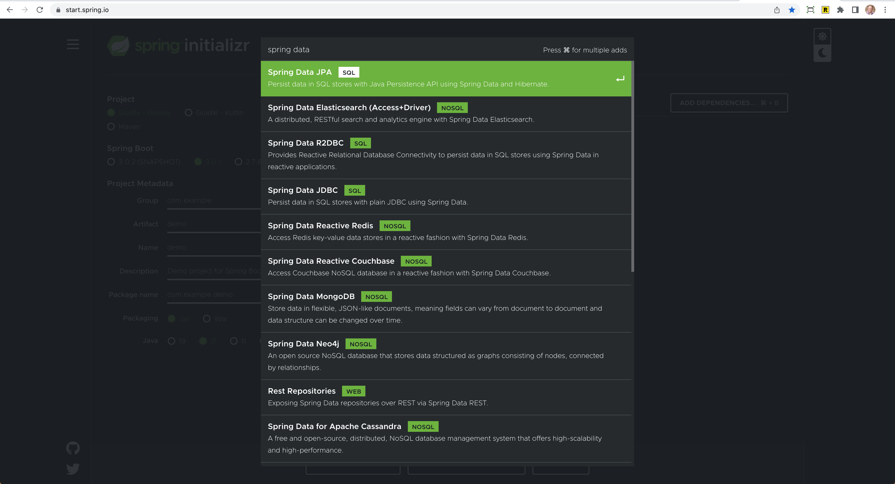

# Data 

At the heart of any application is the data that drives it. Traditionally Java has made connecting to a datasource, 
reading and persisting data verbose and complex. Spring Boot and Spring data takes this process and 
simplifies each step so that you can focus on building applications. 

Spring Boot integrates with a number of data technologies, both SQL and NoSQL.

## Java + SQL Databases

I want to kick off the discussion by taking a trip down memory lane. We are going to take a look at an example
application to see how we can use JDBC (Java DataBase Connectivity) to connect to a database in Java and execute queries.

https://github.com/CodeMash-2023-Spring-Workshop/hello-jdbc

## Spring JDBC API

Spring provides a starter that gives us a database Connectivity API that defines how a client may connect and query 
a database. To get started head over to start.spring.io and select `JDBC API` from the dependency's dropdown. 

This isn't Spring Data - We will cover that later

org.springframework.jdbc.core; -> [API Documentation](https://docs.spring.io/spring-framework/docs/current/javadoc-api/org/springframework/jdbc/core/package-summary.html)

- start.spring.io
  - JDBC API
  - H2 Database
- Checkout the branch `spring-jdbc-start` in the runnerz app
  - This is a continuation of what you saw in the REST API lecture
  - There is a `spring-jdbc-complete` If you just want to watch

The following dependencies were added to `pom.xml`:

```xml
<dependencies>
    <dependency>
        <groupId>org.springframework.boot</groupId>
        <artifactId>spring-boot-starter-jdbc</artifactId>
    </dependency>
    <dependency>
      <groupId>com.h2database</groupId>
      <artifactId>h2</artifactId>
      <scope>runtime</scope>
    </dependency>
</dependencies>
```

## Configuring a Datasource 

Java’s `javax.sql.DataSource` interface provides a standard method of working with database connections. Traditionally, a 'DataSource' uses a URL along with some credentials to establish a database connection.

It is often convenient to develop applications by using an in-memory embedded database. Obviously, in-memory databases do not provide persistent storage. You need to populate your database when your application starts and be prepared to throw away data when your application ends. 

An in-memory embedded database is great for:

- Rapid prototyping 
- Demos
- Testing (traditionally)

```properties
spring.h2.console.enabled=true
spring.datasource.name=runnerz
spring.datasource.generate-unique-name=false
```

NOTE: HikariCP Connection Pool

### PostgreSQL

While getting started with an in-memory embedded database is trivial, what about a "real" database?

```xml
<dependencies>
  <dependency>
      <groupId>org.postgresql</groupId>
      <artifactId>postgresql</artifactId>
      <version>42.2.23</version>
  </dependency>
</dependency>
```

```properties
spring.datasource.url=jdbc:postgresql://localhost:5432/postgres
spring.datasource.username=postgres
spring.datasource.password=password
```

## Populating a Database

You have a few options for populating a database: 

- DDL Script 
- Programmatically
- Database Migration Tool

#### DDL Script

```properties
spring.sql.init.schema-locations=
spring.sql.init.mode=always
```

```sql
CREATE TABLE IF NOT EXISTS Run (
    id INT AUTO_INCREMENT,
    title varchar(250) NOT NULL,
    started_on timestamp NOT NULL,
    completed_on timestamp NOT NULL,
    miles INT NOT NULL,
    location varchar(10) NOT NULL,
    PRIMARY KEY (id)
);

INSERT INTO Run(title,started_on,completed_on,miles,location)
VALUES ('Monday Morning Run',CURRENT_TIMESTAMP(),TIMESTAMPADD('minute',30,CURRENT_TIMESTAMP()),3,'INDOOR');

INSERT INTO Run(title,started_on,completed_on,miles,location)
VALUES ('Tuesday Evening Run',CURRENT_TIMESTAMP(),TIMESTAMPADD('minute',60,CURRENT_TIMESTAMP()),6,'INDOOR');
```

Run the application and then set the following property and rerun the application: 

```properties
logging.level.org.springframework.jdbc=DEBUG
```

#### Programmatically

You can use the `CommandLineRunner` Interface which is used to indicate that a bean should _run_ when it is contained within
* a **SpringApplication**. We aren't going to be able to insert data just yet but I want to show you 2 approaches. 

```java
@Component
public class DataInit implements CommandLineRunner {
    @Override
    public void run(String... args) throws Exception {
        System.out.println("Application has started!");
    }
}
```

```java
@Bean
CommandLineRunner commandLineRunner() {
    return (args) -> System.out.println("Hello, Application!");
}
```

#### Database Migration Tool

We aren't going to cover this option in this workshop but a popular tool for this is [Flyway](https://flywaydb.org/)

## JDBC Template

Spring’s `JdbcTemplate` and `NamedParameterJdbcTemplate` classes are auto-configured, and you can `@Autowire` them directly into your own beans. 

**Notes:** 
  - Discuss [JdbcTemplate](https://docs.spring.io/spring-framework/docs/current/javadoc-api/org/springframework/jdbc/core/JdbcTemplate.html) vs [NamedParameterJdbcTemplate](https://docs.spring.io/spring-framework/docs/current/javadoc-api/org/springframework/jdbc/core/namedparam/NamedParameterJdbcTemplate.html)
  - Assigning dynamic parameters "where id = ?" vs "where id = :id"

```java
@Service
public class RunService {

    private final JdbcTemplate jdbcTemplate;

    // remember that @Autowired is implicit
    public RunService(JdbcTemplate jdbcTemplate) {
        this.jdbcTemplate = jdbcTemplate;
    }

}
```
This is the final code for the `RunService` that contains all the CRUD operations using a `JdbcTemplate`.

```java
@Service
public class RunService {

    private static final Logger log = LoggerFactory.getLogger(RunService.class);
    private final JdbcTemplate jdbcTemplate;

    public RunService(JdbcTemplate jdbcTemplate) {
        this.jdbcTemplate = jdbcTemplate;
    }

    RowMapper<Run> rowMapper = (rs, rowNum) -> new Run(rs.getInt("id"),
            rs.getString("title"),
            rs.getObject("started_on",LocalDateTime.class),
            rs.getObject("completed_on",LocalDateTime.class),
            rs.getInt("miles"),
            Location.valueOf(rs.getString("location")));

    public List<Run> findAll() {
        String sql = "SELECT id,title,started_on,completed_on,miles,location from Run";
        return jdbcTemplate.query(sql,rowMapper);
    }

    public Run findById(Integer id) {
        String sql = "SELECT id,title,started_on,completed_on,miles,location from Run where id = ?";
        return jdbcTemplate.queryForObject(sql,rowMapper,id);
    }

    public void create(Run run) {
        String sql = "INSERT INTO Run(title,started_on,completed_on,miles,location) VALUES(?,?,?,?,?)";
        int rows = jdbcTemplate.update(sql, run.title(), run.startedOn(), run.completedOn(), run.miles(), String.valueOf(run.location()));
        if(rows == 1) {
            log.info("Run was created successfully!");
        }
    }

    public void update(Run run, int id) {
        String sql = """
                UPDATE RUN
                SET title = ?,
                    started_on = ?,
                    completed_on = ?,
                    miles = ?,
                    location = ?
                WHERE id = ?
                """;
        int rows = jdbcTemplate.update(sql, run.title(), run.startedOn(), run.completedOn(), run.miles(), String.valueOf(run.location()), id);
        if(rows == 1) {
            log.info("Run was updated successfully!");
        }
    }

    public void delete(int id) {
        String sql = "DELETE from Run where id = ?";
        int rows = jdbcTemplate.update(sql, id);
        if(rows == 1) {
            log.info("Run was deleted successfully!");
        }
    }

}
```

### Command Line Runner 

Now that you have a service that can create a new `Run` lets revisit that `CommandLineRunner`.

```java
@Bean
CommandLineRunner commandLineRunner(RunService runService) {
    return (args) -> runService.create(new Run(null,"Sunday Morning Run", LocalDateTime.now(),LocalDateTime.now().plus(70, ChronoUnit.MINUTES),7, Location.OUTDOOR));
}
```

## Spring Data

Spring Data’s mission is to provide a familiar and consistent, Spring-based programming model for data access while still retaining the special traits of the underlying data store.

**Features**
  - Powerful repository and custom object-mapping abstractions
  - Dynamic query derivation from repository method names
  - Implementation domain base classes providing basic properties
  - Support for transparent auditing (created, last changed)
  - Possibility to integrate custom repository code

**SQL / NoSQL Support**
- SQL
  - MySql, PostgreSQL, Oracle, MsSQL, etc...
- NoSQL
  - Redis, MongoDB, Apache Cassandra, etc...

### Spring Data Modules

- Main Modules
  - Spring Data Commons - Core Spring concepts underpinning every Spring Data module.
  - **Spring Data JDBC** - Spring Data repository support for JDBC.
  - **Spring Data JPA** - Spring Data repository support for JPA.
  - Spring Data MongoDB - Spring based, object-document support and repositories for MongoDB.
  - Spring Data Redis - Easy configuration and access to Redis from Spring applications.
  - Spring Data REST - Exports Spring Data repositories as hypermedia-driven RESTful resources.
  - Spring Data for Apache Cassandra - Easy configuration and access to Apache Cassandra or large scale, highly available, data oriented Spring applications.
  - More ...  
- Community Modules
  - Spring Data Couchbase - Spring Data module for Couchbase.
  - Spring Data Azure Cosmos DB - Spring Data module for Microsoft Azure Cosmos DB.
  - Spring Data DynamoDB - Spring Data module for DynamoDB.
  - Spring Data Elasticsearch - Spring Data module for Elasticsearch.
  - Spring Data Hazelcast - Provides Spring Data repository support for Hazelcast.
  - Spring Data YugabyteDB - Spring Data module for YugabyteDB distributed SQL database.
  - More...

https://spring.io/projects/spring-data
 
### Spring Boot Starters

If you want to get an idea of starter support head over to start.spring.io -> Dependencies and type in "Spring Data"



## Spring Data JDBC

Spring Data JDBC, part of the larger Spring Data family, makes it easy to implement JDBC based repositories. This module deals with enhanced support for JDBC based data access layers. It makes it easier to build Spring powered applications that use data access technologies. Spring Data JDBC aims at being conceptually easy. In order to achieve this it does NOT offer caching, lazy loading, write behind or many other features of JPA. This makes Spring Data JDBC a simple, limited, opinionated ORM.

All Spring Data modules are inspired by the concepts of "repository", "aggregate", and "aggregate root" from Domain Driven Design. These are possibly even more important for Spring Data JDBC, because they are, to some extent, contrary to normal practice when working with relational databases.

[Spring Data JDBC Tutorial](https://youtu.be/l_T0nQNbFiM)

### Dependencies 

- start.spring.io
  - If you were creating a new project from scratch
- Existing Project
  - Checkout branch `spring-data-jdbc-start`
  - Spring Data JDBC
  - Database (H2)

The following dependencies were added to `pom.xml`:

```xml
<dependencies>
  <dependency>
      <groupId>org.springframework.boot</groupId>
      <artifactId>spring-boot-starter-data-jdbc</artifactId>
  </dependency>
  <dependency>
      <groupId>com.h2database</groupId>
      <artifactId>h2</artifactId>
      <scope>runtime</scope>
  </dependency>
</dependencies>
```

### Persistent Entities

Before we start writing some code lets talk about some terms you will encounter: 

- **DTO**: A class whose purpose is to transfer data, usually from the server to the client (or vie versa).
- **Entity**: A class whose purpose is to store/retrieve data to/from a data store.
- **POJO**: A class that doesn't extend any framework code not has any sort of restrictions baked into it. 

* Thank you to Greg Turnquist's new book [Learning Spring Boot 3.0](https://amzn.to/3Z8b8h4) for defining those terms for us.

  - ID
    - @Id
    - Generation
  - Custom table names
  - Custom column names

There is a lot more that goes into building out your entities and we have only scratched the surface.

https://docs.spring.io/spring-data/jdbc/docs/current/reference/html/#jdbc.entity-persistence

### Repositories

The goal of the Spring Data repository abstraction is to significantly reduce the amount of boilerplate code required to implement data access layers for various persistence stores. 

In the example you are working on today you need to provide CRUD operations for a single
entity. Even working on a single entity there is a lot of boilerplate code that has to be written before you get to the critical 
business requirements you have been given. How many times have you been a project and asked to write a query to do x,y,and z sort it by these fields and oh ya please only return 10 records at a time.

- Repository
- CRUD & ListCrudRepository
- PagingAndSorting & ListPagingAndSorting
- Don't add `@Repository` stereotype marker

The repository proxy has two ways to derive a store-specific query from the method name:

- By deriving the query from the method name directly.
  - [Query Creation](https://docs.spring.io/spring-data/commons/docs/current/reference/html/#repositories.query-methods.query-creation)
  - [Supported query method subject keywords](https://docs.spring.io/spring-data/commons/docs/current/reference/html/#appendix.query.method.subject)
- By using a manually defined query.

- Query derivation (FindBy)
  - findRunsByTitleStartingWith
  - findRunsByLocation
  - findRunsByMilesIsAndLocationIs
  - findAllByStartedOnAfterAndMilesGreaterThan
  - findAllByStartedOnAfterAndMilesGreaterThanEqual
- `@Query` manually defining a query
  - listRunsWhereMilesEquals
  - Java Text Blocks

**Further Reading**:
- [Query By Example](https://docs.spring.io/spring-data/jdbc/docs/current/reference/html/#query-by-example)
- [Lifecycle Events](https://docs.spring.io/spring-data/jdbc/docs/current/reference/html/#jdbc.events)
- [Transactions](https://docs.spring.io/spring-data/jdbc/docs/current/reference/html/#jdbc.transactions)
- [Auditing](https://docs.spring.io/spring-data/jdbc/docs/current/reference/html/#auditing)

## Lecture Notes

- Browser Tabs
  - Lecture Notes
  - JDBC Core
  - localhost:8080
- Hello JDBC
  - Docker Desktop Running
- Runnerz
  - spring-jdbc-start branch
- Timing
  - 1st run through about 65 minutes
  - Didn't get to a lot of the dynamic query derivation examples
    - Make sure these are all in the completed branch
  - Live Templates - Create some live templates where we can shorten some things up