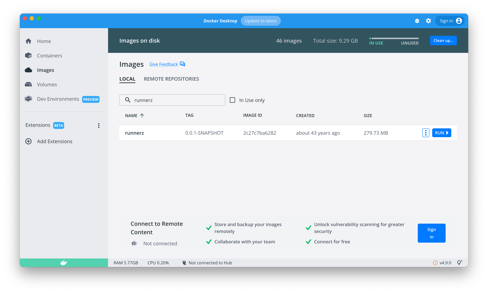

# Production

Production is the greatest place on the web! We should all want to go there but we get it, it can be a scary place.

In this lecture you will learn how to build your application using the following methods: 

- Uber JAR
- Containers
- Native Image

## Uber JAR 

The spring-boot-loader modules lets Spring Boot support executable jar and war files. If you use the Maven plugin or the Gradle plugin, executable jars are automatically generated, and you generally do not need to know the details of how they work.

To create an executable JAR run the following command: 

`./mvnw clean package`

- **clean**: Deletes the target folder
- **package**: Invoke Maven's package phase, which will cause the verify, compile and test phases to be invoked in the correct order.

To run the executable JAR with Java run the following command: 

`java -jar target/runnerz-0.0.1-SNAPSHOT.jar`

https://docs.spring.io/spring-boot/docs/current/reference/html/executable-jar.html#appendix.executable-jar

## Containers

In the previous section you learned how to build an Uber JAR and run it on any machine that has a JDK. What if there is no JDK? 

This is where containers and specifically Docker containers can help us out. You have already seen some examples of us
running a Docker Compose file to run a production grade database locally. 

You can create a production version of your Spring Boot application using Dockerfiles, or by using Cloud Native Buildpacks to create optimized docker compatible container images that you can run anywhere.

https://docs.spring.io/spring-boot/docs/current/reference/html/container-images.html#container-images

As long as you have Docker desktop running you can run the following command to create an OCI image: 

`./mvnw spring-boot:build-image`

`docker image ls -a`

`docker run -it -p8080:8080 runnerz:0.0.1-SNAPSHOT`

To learn more about Packaging OCI Images check out the [documentation](https://docs.spring.io/spring-boot/docs/3.0.1/maven-plugin/reference/htmlsingle/#build-image).

## Native Images

Spring Boot 3.0 applications can now be converted into GraalVM native images which can provide significant memory and startup-up performance improvements. Spring Boot requires GraalVM 22.3 or later and Native Build Tools Plugin 0.9.17 or later to build native images. If you would like to learn more about GraalVM Native Image Support you can check out the [reference documentation](https://docs.spring.io/spring-boot/docs/3.0.0/reference/html/native-image.html#native-image).

With the native profile active, you can invoke the native:compile goal to trigger native-image compilation:

`mvn -Pnative native:compile`

The result will be a native executable in the `target/` directory.

Spring Boot includes buildpack support for native images directly for both Maven and Gradle. This means you can just type a single command and quickly get a sensible image into your locally running Docker daemon. The resulting image will not contain a JVM, instead the native image is compiled statically. This leads to smaller images.

To build the image, you can run the `spring-boot:build-image` goal with the native profile active:

`mvn -Pnative spring-boot:build-image`

If you're using buildpacks on ARM64 (macOS) you will want to check out the article below by DaShaun Carter.

[A new builder for Spring Boot 3 RC1 on ARM64](https://dashaun.com/posts/paketo-aarch64-builder-spring-boot-3-rc1/)

## Hosts 

Here are a few services that you can deploy your Spring Boot Applications on: 

- [Amazon Web Services (AWS)](https://aws.amazon.com/)
- [Azure Spring Apps](https://azure.microsoft.com/en-us/products/spring-apps)
- [Google Cloud](https://cloud.google.com/)
- [OpenShift](https://www.redhat.com/en/technologies/cloud-computing/openshift)
- [Cloud Foundry](https://www.cloudfoundry.org/)
- [Digital Ocean](https://www.digitalocean.com/)
- [Railway](https://railway.app/)
- [Heroku](https://www.heroku.com/)
- [Render](https://render.com/)
- [Fly.io](https://fly.io/)
- [Porter](https://porter.run/)

## Resources

Here are a few videos from Spring Office Hours and Dan's YouTube channel on moving your Spring Boot applications into production.

- [Spring Office Hours: Spring to Production Part 1](https://tanzu.vmware.com/developer/tv/spring-office-hours/0015/)
- [Spring Office Hours: Spring to Production Part 2](https://tanzu.vmware.com/developer/tv/spring-office-hours/0016/)
- [Spring Boot Azure](https://youtu.be/53T_R3xAPTg)
- [Spring Boot Heroku](https://youtu.be/lGtTOLKuvqs)
- [Spring BOot Railway](https://youtu.be/5sVxvF47dcU)